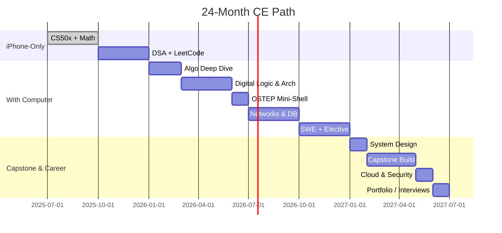

# 🛠️ Road‑map 24 เดือนสู่วิศวกรคอมฯ  
*(ก.ค. 2025 → มิ.ย. 2027)*  

> **ข้อกำหนด:**  
> * ช่วง **ก.ค.–ธ.ค. 2025** ยังไม่มีคอมพิวเตอร์ (ใช้ iPhone + ChatGPT + IDE บนคลาวด์)  
> * ได้เครื่องจริงวันที่ **01 ม.ค. 2026**  

---

## โครงสร้างหลักสูตรอ้างอิง

| หมวด | ตัวอย่างวิชา |
|------|--------------|
| **Math & Science** | Calculus • Linear Algebra • Physics • Probability |
| **Core CS/CE** | Programming • Data Structures • Algorithms |
| **Hardware Layer** | Digital Logic • Microprocessor • Computer Architecture |
| **Systems Layer** | Operating Systems • Networking • Database |
| **Electives & Capstone** | AI/ML • Embedded • Security • Senior Project |

---

## เฟส 1 : ก.ค.–ธ.ค. 2025 *(iPhone‑only)*  

| เดือน | เป้าหมายหลัก | เครื่องมือ / สื่อ | ผลลัพธ์ (Deliverable) |
|-------|--------------|-------------------|-----------------------|
| **M1‑2** 15 ก.ค. | **CS50x** – พื้นฐาน C, Python, Algos (สัปดาห์ 0‑8) | Replit Mobile | ส่ง pset 5 ชุดใน GitHub |
| **M3** | **Math Crash** – Calc I, Linear Algebra (Khan/Brilliant) | Obsidian Mobile | สรุปสูตร & แนวคิด 1 vault |
| **M4** | **Discrete Math** – Logic, Sets, Recurrence | MIT 6.042 (OCW) | Flash‑cards 50 ใบ |
| **M5‑6** | **Data Structures เบื้องต้น** + LeetCode วันละข้อ | GitHub Codespaces (120 hrs/mo) | รีโป “dsa‑100‑problems” |

---

## เฟส 2 : ม.ค.–มิ.ย. 2026 *(มีคอมแล้ว – ปี 1 ระบบ)*  

| เดือน | วิชา | แหล่งเรียน | โปรเจกต์ |
|-------|------|------------|----------|
| **M7‑8** | **Algorithms เชิงลึก** (Divide & Conquer, DP, Greedy) | Coursera / Princeton Algos I‑II | สร้าง “algo‑visualiser” |
| **M9** | **Digital Logic + Microcontroller** | Logisim‑evolution, Tinkercad | โมเดล 8‑bit ALU |
| **M10‑11** | **Computer Architecture** | ‘nand2tetris Part I’ | CPU จำลองระดับสัญญาณ |
| **M12** | **Operating Systems** (บท 1‑8 *OSTEP*) | GCC + VS Code | เขียน mini‑shell (pipes, fork) |

---

## เฟส 3 : ก.ค.–ธ.ค. 2026 *(Systems & Networking)*  

| ช่วง | วิชา | Outcome |
|------|------|---------|
| **M13‑14** | **Computer Networks I** – TCP/IP, HTTP | HTTP server + Packet sniffer |
| **M15** | **Database Systems** – ER, SQL, Index | REST API + Postgres |
| **M16‑17** | **Software Engineering** – Git flow, CI/CD, Patterns | เว็บ App teamwork (GitHub) |
| **M18** | **Elective #1**  → *เลือกหนึ่ง* • AI/ML (fast.ai) หรือ • Embedded (STM32) | Prototype α พร้อม README |

---

## เฟส 4 : ม.ค.–มิ.ย. 2027 *(Capstone & Career)*  

| เดือน | กิจกรรม | ผลลัพธ์ |
|-------|---------|---------|
| **M19** | **System Design Basics** + Case studies | บันทึก 10 ระบบยอดนิยม |
| **M20‑22** | **Capstone Project** (ทีมออนไลน์ 3‑5 คน) | MVP + Demo Day (YouTube) |
| **M23** | **Cloud & Security** (AWS SAA หรือ Kubernetes CKA) | เวอร์ชัน Prod deploy |
| **M24** | **Portfolio & Interview Prep** | Blog 4 บท • CV • LeetCode ≥ 300 |

---

## Mermaid Timeline

---

## เช็กลิสต์ปิดภารกิจ (Exit Criteria)

- [ ] GitHub Portfolio ≥ 3 โปรเจกต์
- [ ] LeetCode ≥ 300 ข้อ + สรุปวิธีคิด
- [ ] Capstone พร้อมสาธิต (วิดีโอ & README)
- [ ] Blog/N.B. สรุปครบทุกหมวด
- [ ] อย่างน้อย 1 Certificate (AWS / ML / Embedded)

---

> **เคล็ดลับใช้ ChatGPT**  
> 1) สั่งให้สร้าง Quiz ทุกบท  2) ให้รีวิว PR  3) สรุปสิ่งเรียนรู้ทุกสิ้นเดือน  
> *(วางไฟล์นี้ใน Obsidian หรือ Joplin แล้วเปิดโหมด Markdown Preview 👍)*  
